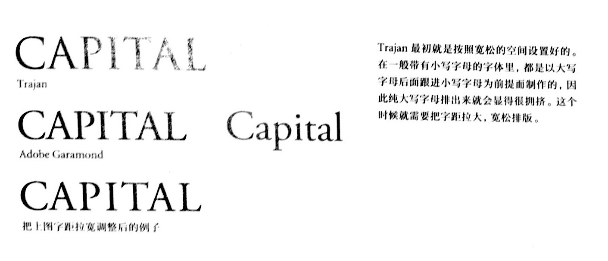

罗马体（衬线体）&无衬线体

罗马体在长篇文章里具有良好的阅读性，是适合书籍印刷的字体。衬线能更好地诱导视线**横向移动**，线条的强弱对比舒适，连续阅读不易产生疲劳。中文小说经常使用与衬线体风格类似的**宋体**，理由也是一样的。无衬线体原来是为了海报等提高易认性而诞生的字体，并不是以阅读长篇文章为前提而设计的。

* 根据文章内容决定哪种字体

可能是因为图册、商品目录里的汉字越来越多的使用黑体，为了与之搭配，长篇文章里也常使用无衬线体。当询问设计师为什么选择无衬线体时，一般得不到明确的回答。说不定，他们只是凭感觉选了无衬线体而已。
如果要提高无衬线体的易读性，有一种方法时，与相同字号的罗马体相比，把行长稍微缩短一些，行距拉大一些。

* 大小写字母

在大小写字母混合排版的文章里，由于首字母是大写，因此很容易判断出句子的开始，而且x字高的上下具有空间，会觉得行距比较宽松，更容易阅读。
纯大写字母排版里，几乎所有的单词看起来都近似长方形，虽然富有冲击力，但易读性会很差。如果是长单词的话，识别性会大幅降低。这是因为我们在阅读单词的时候，并不是在辨认一个一个字母，而是在辨识整个单词的轮廓。

纯大写字母的排版，如果仅限于几个单词或者几行，则会非常醒目。比如Trajan这款基于古罗马时代的石碑字体，它没有小写字母，用在标题等以大字号宽松排版的话，就能极大发挥字体本身的优点。
**大写字母的排版是「为了显示」的排版方式，大小写混排是「为了让人阅读」的排版方式。**

