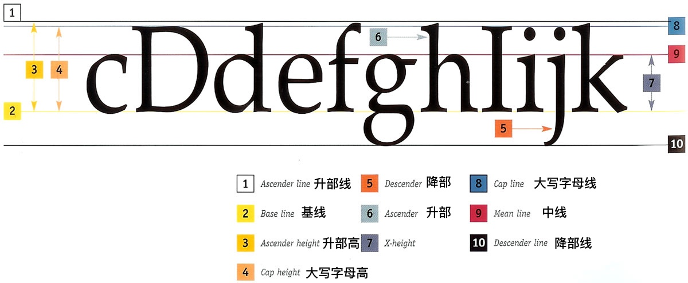
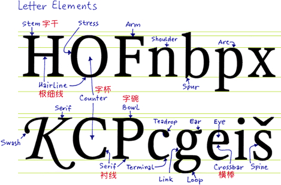
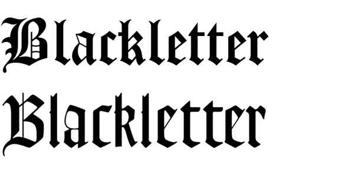
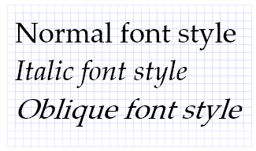
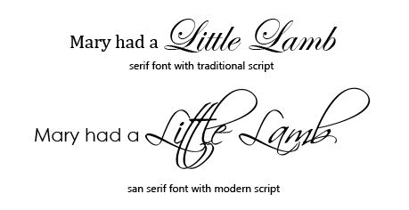
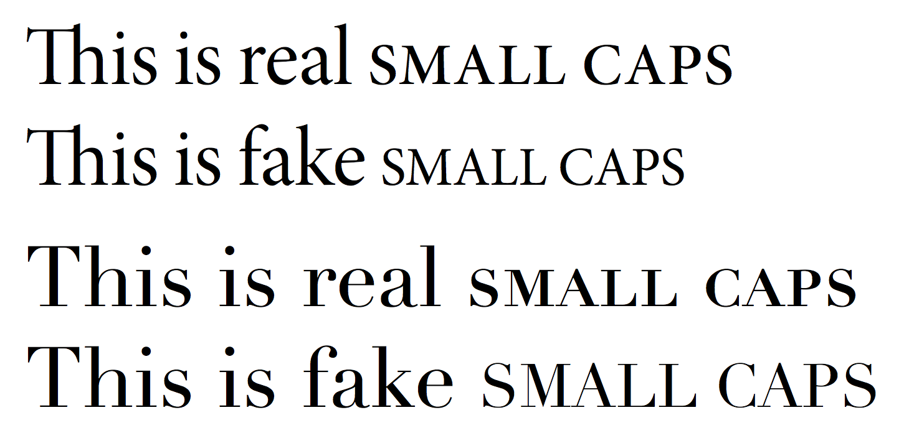
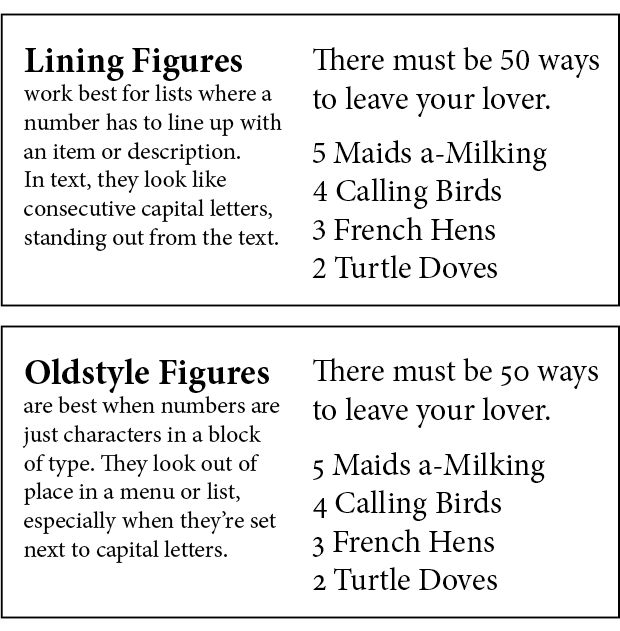
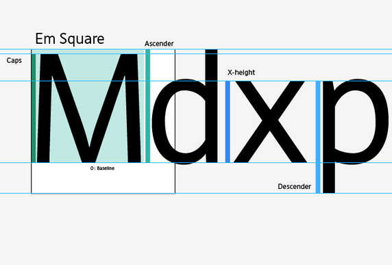
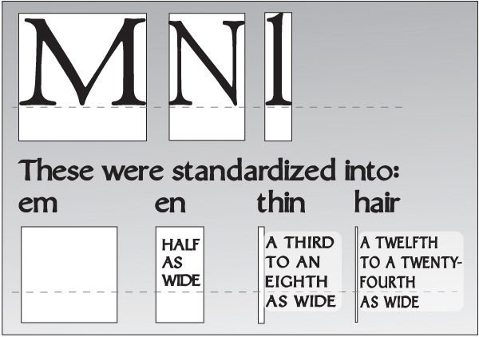

Latin Letter Typography Basic Knowledge

* 拉丁字母

	另称罗马字。欧美所使用的文字，法文、德文、意大利文、西班牙文等从拉丁文派生出来的文字语言，这些文字总称「拉丁字母」。如果只说「字母」，有时还会指希腊字母、阿拉伯字母等表音文字，所以这里用「拉丁字母」加以区别。

* 字库（font） 

	字体里**大小写字母、数字、标点符号和声调符号等**一整套的总称。不被印出来的空格也是font的一部分。构成font的要素称为「字形」（glyph）。如果在Illustrator、Indesign里点选「字形」，就可以看到一款字体里所配备的所有字形。

* 各部位的名称：
	
	

* 罗马体（roman）

	罗马体是指笔画末端带有**衬线**，且如平头笔书写般，有粗细笔画的一类字体的总称。一般来说，罗马体的衬线突出了字母的造型，更易于阅读，适合排编书籍等长篇文章。另外，roman还有另外一个意思，即**「罗马正体」**，是指区别于「意大利斜体」的垂直正立的字体。

* 无衬线体（sanserif）

	法语中sans即「无」的意思，，因此sanserif就是**「没有衬线」**的意思。在美国、日本常被称为「哥特体」（gothic），但gothic这个词在欧洲一般用来特指「黑字体」（black letter），为了避免混淆，我们还是使用「无衬线体」这个词来加以区别。



* 意大利斜体（italic）

	保留了浓厚手写风格特征的一种倾斜字体。它并不是把正体字单纯的加以倾斜，小写字母的a、f、e、w等都具有与罗马体不同的独特造型。其中部分字体是把垂直的字母造型直接加以倾斜，所以另称为**「单斜体」（oblique）**予以区别。


* 手写体（script）
	具有手写风格的字体，大致分为两种：
	* **传统风格的铜板手写体**，它原本是把用笔书写的字体雕刻在铜板上进行凹版印刷而成的，后来又转刻成了金属活字。
	* **现代风格的手写体**，根据所用书写工具不同，具有各式各样的表现。


* 字距（letter space）、词距（word space）

* 行间距（line space）

	行与行之间的距离叫做行间距。但在现代排版软件（比如Adobe）中，是把从**基线到基线的距离**称为行距。
	
* 字体家族（family）

	同一个字库里，可能同时拥有Roman、Italic、Bold、Black等好几类字体。
	
* 小型大写字母（small caps）

	大致与小写字母x字高相当的大写字母。为了与普通的大写字母的笔画和粗细匹配，small caps稍微粗、宽一些，并不是单纯地将大写字母缩小而成。
	
* 等高数字和老式数字（lining figure and old figure）

	上下对齐的数字叫**等高数字**，上下参差错开常用于书记排版等正文使用的是**老式数字**。一般来说，等高数字的字宽也是相同的。
	
* 点、派卡（point and pica）

	1 point ≈ 0.3528 mm是1/72 inch，用来度量字号、行距的单位。1 pica = 12 point，用来指定行长、印刷位置等。
	
* 字号（font size）

	
	升部线与将部线之间的距离。
	
* em & en

	
	金属活字里大写字母「M」的上下左右长度几乎一样，概念上把「全角」称为em，其一半（n的宽度）即「半角」称为en。如果使用的字号是8 point，则高与宽都为8 point即为1 em，高8 point宽4 point就是1 en。
