#优秀排版所需具备的知识

罗马体在长篇文章里具有良好的阅读性，是适合书籍印刷的字体。衬线能更好地诱导视线**横向移动**，线条的强弱对比舒适，连续阅读不易产生疲劳。中文小说经常使用与衬线体风格类似的**宋体**，理由也是一样的。无衬线体原来是为了海报等提高易认性而诞生的字体，并不是以阅读长篇文章为前提而设计的。

## 根据文章内容决定哪种字体

可能是因为图册、商品目录里的汉字越来越多的使用黑体，为了与之搭配，长篇文章里也常使用无衬线体。当询问设计师为什么选择无衬线体时，一般得不到明确的回答。说不定，他们只是凭感觉选了无衬线体而已。
如果要提高无衬线体的易读性，有一种方法时，与相同字号的罗马体相比，把行长稍微缩短一些，行距拉大一些。

## 大小写字母

在大小写字母混合排版的文章里，由于首字母是大写，因此很容易判断出句子的开始，而且x字高的上下具有空间，会觉得行距比较宽松，更容易阅读。
纯大写字母排版里，几乎所有的单词看起来都近似长方形，虽然富有冲击力，但易读性会很差。如果是长单词的话，识别性会大幅降低。这是因为我们在阅读单词的时候，并不是在辨认一个一个字母，而是在辨识整个单词的轮廓。

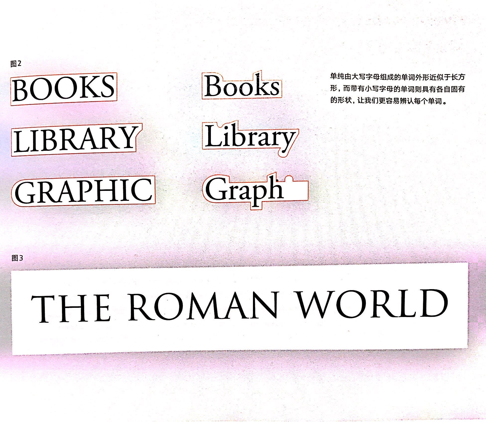

纯大写字母的排版，如果仅限于几个单词或者几行，则会非常醒目。比如Trajan这款基于古罗马时代的石碑字体，它没有小写字母，用在标题等以大字号宽松排版的话，就能极大发挥字体本身的优点。
**大写字母的排版是「为了显示」的排版方式，大小写混排是「为了让人阅读」的排版方式。**

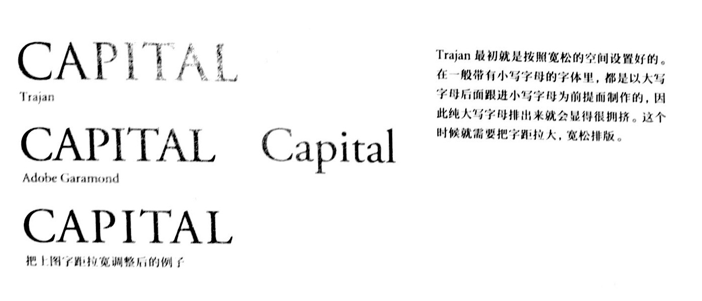

## 文章的大小标题

为了简要地说明正文的内容，我们会给文章加上标题。作为最基本的使用方法，**大标题、小标题都使用与正文字体同一个家族的字体是比较保险的**。改变字号时，要让读者能明确感觉到字号区别。
有些字体如果单纯把正文字体放大使用会显得过于厚重，因此使用字体家族中的Display或者Light这样的**细体字**会给人一种简洁而有品位的感觉。正文和小标题的距离，与大标题和小标题之间的距离相比要小一些，这样看起来能和正文融为一体。不要使用同是罗马系列的不同字体，否则会给人一种微妙的不协调感。

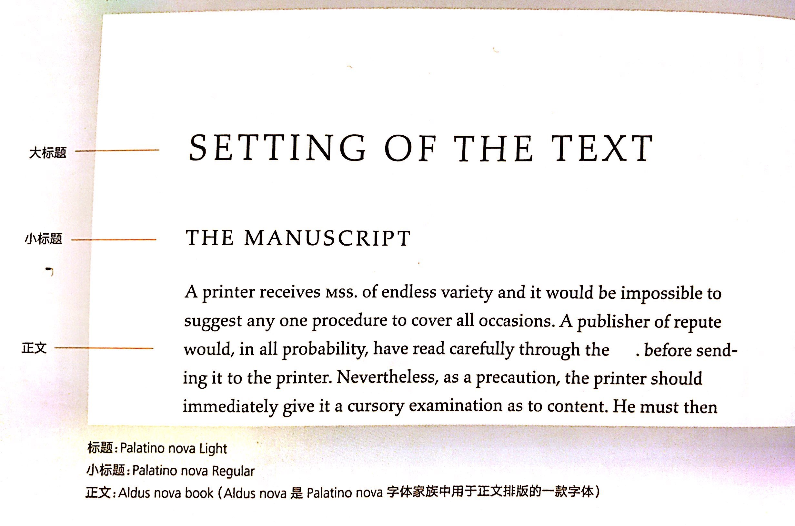

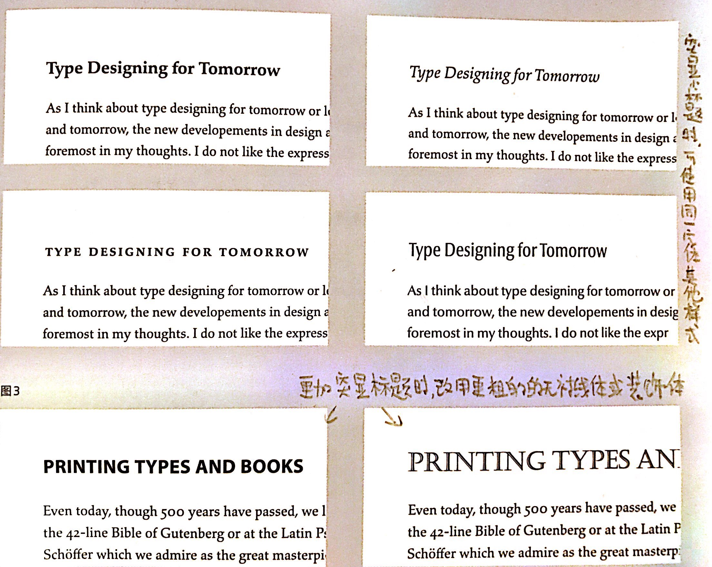

标题太长必须要两行时，必须避免把单独一个单词剩到第二行，而且不能用连字符断词。标题最好不要占用三行以上，**尽量放到一行**。如果实在没有办法满足这些条件，应该考虑修改文稿。

## 意大利斜体

在文章排版里，意大利斜体主要是起辅助罗马体的作用。不仅是像书籍那样的长篇文章，像商品样册、图录里的短文也是和罗马体一起使用。
书籍排版中意大利斜体的用法在习惯上的规范：
	
	* 表示强调、希望留下深刻印象的语句
	* 文献名（书名、杂志名、报纸名等）
	* 话剧歌剧、诗歌等的标题，艺术、绘画的作品名等
	* 外文：蔽日在英文的正文排版里出现法文等外文单词时
	* 数学符号和音乐记号
	* 生物的学名

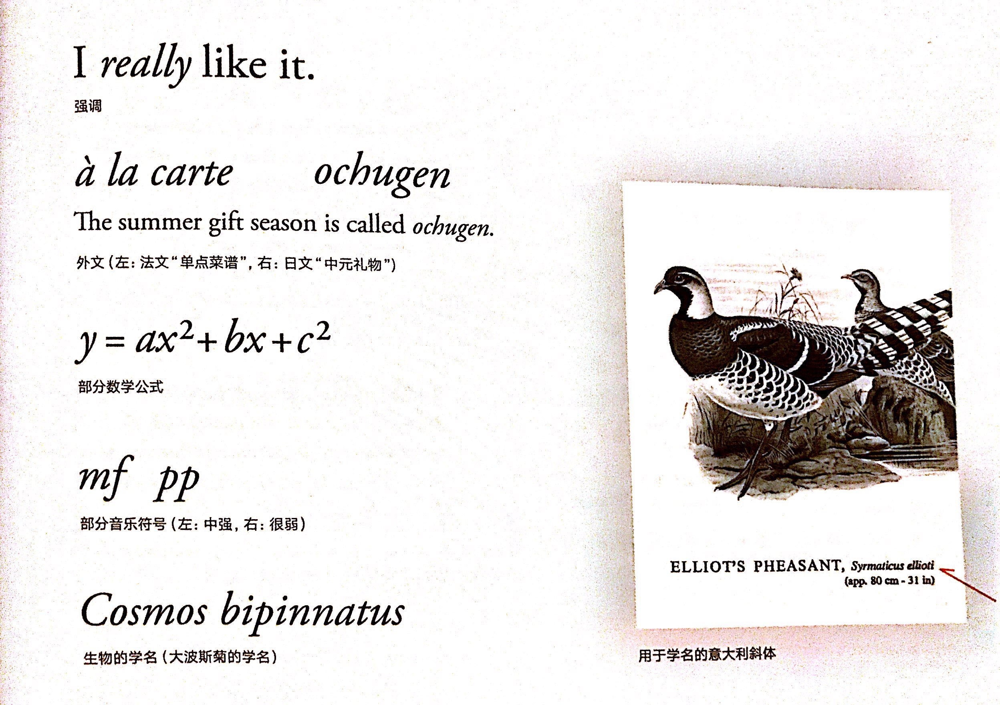

使用无衬线体也是如此。

另外，用罗马体排版的标题、脚注、旁注等也可以使用意大利斜体。这样可以与正文区分，整体排版效果也比较协调。

当然，和书籍排版相去甚远的领域，比如广告、包装方面，则不必过多的拘泥于意大利斜体的用法。

意大利斜体也可以单独用于排正文。由于意大利斜体原本是从手写体诞生的，因此可以把它当作富有「手写感觉的字体」来使用。对于请柬、奖状以及想表达**柔美情感的诗歌**等，如果短文也可以单独采用意大利斜体来进行排版。
排版上必须注意的是词距。在活字时代，空格搜时排版工人依照自己的判断加入的。意大利斜体的字母本身瘦长，如果加入和罗马体一样的空格，词距会显得过宽。
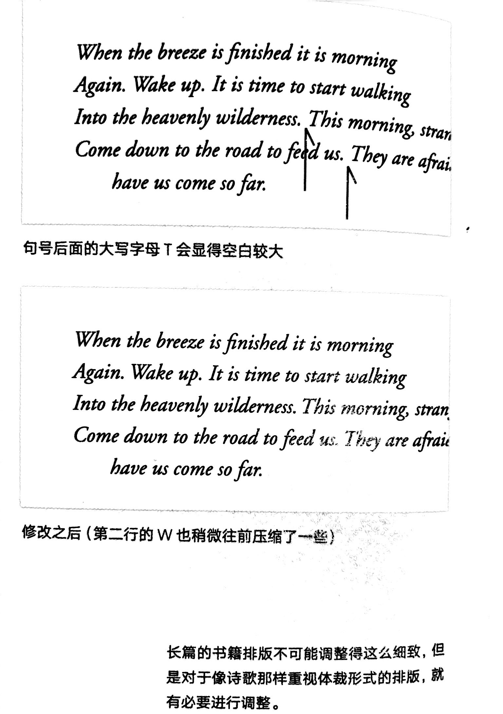
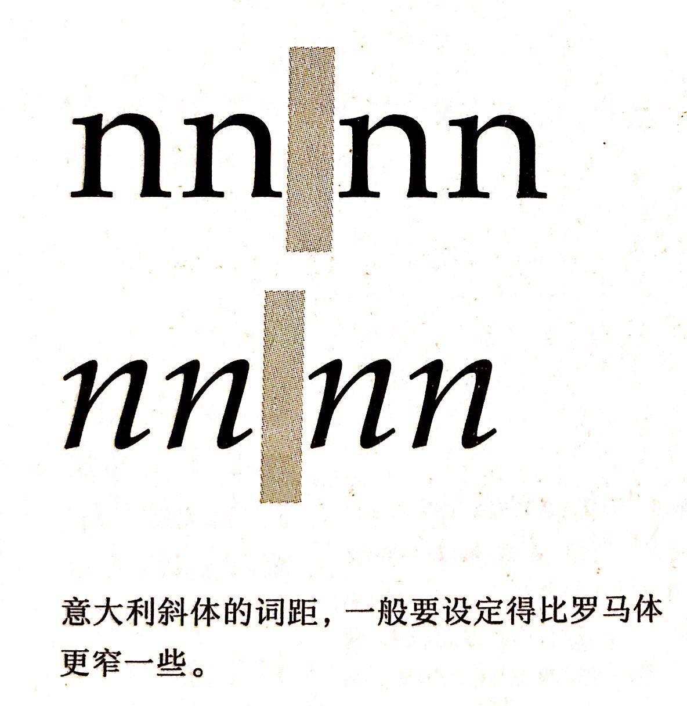
现在，由于词距都是在电脑字库事先先设定好的，那些难看的排版就不太常见了。但是不同的字体在排列时，还是回出现过于宽松的地方。如果要进行更高品质的排版，就需要对词距逐个地进行检查和调整。
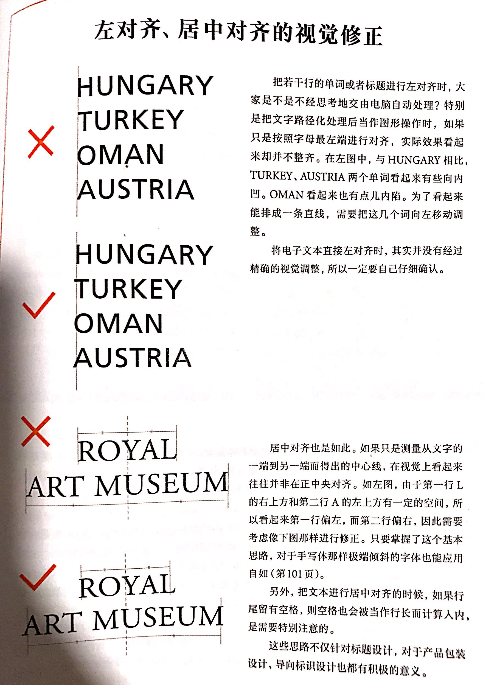

## 小型大写字母
在长篇文章的排版里，如果用大写字母排特定单词、缩略语，该处会显得特别突兀。对于大小写混合文章里，在不影响阅读流畅的前提下想要适当地突出部分内容，或者想明确突出该词为缩略语时，可以使用*小型的大写字母（small caps）*。

虽然没有严格规定的使用方法，但是小型大写字母能融入长文，又不会过度影响阅读的视线，希望大家可以积极多用。一般会多用于AD（Anno Domini公元，放在数字之前），BC（Before Christ公元前，放在数字之后），以及国际、国家机关等首字母缩写。还可以用于书籍的标题、页眉、图版的图注、首字母后面的最初几个单词等等。

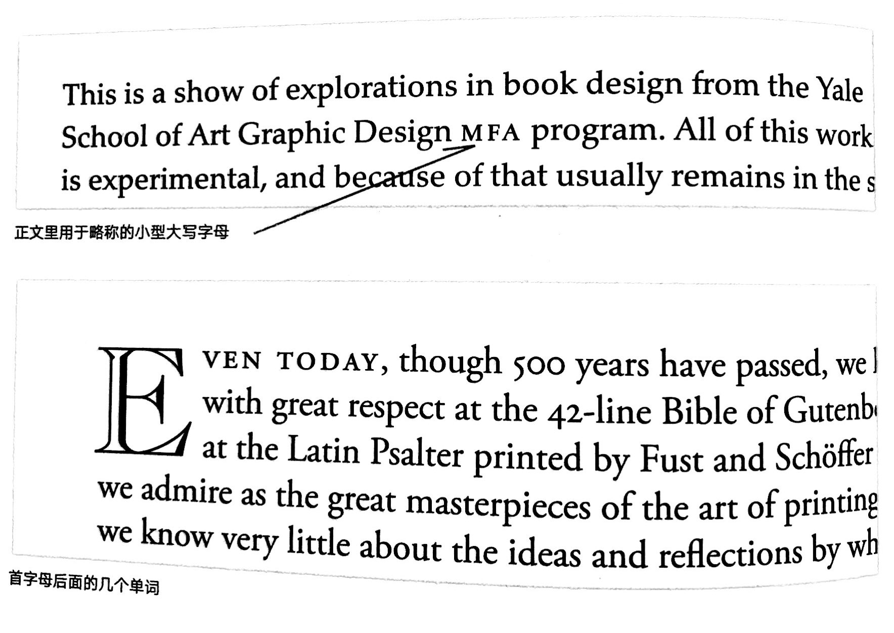
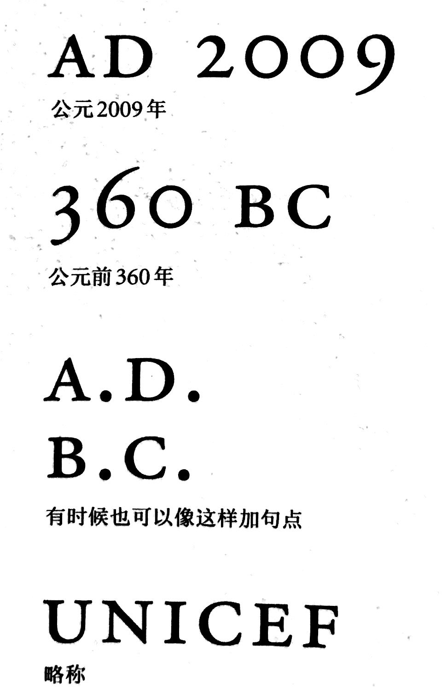
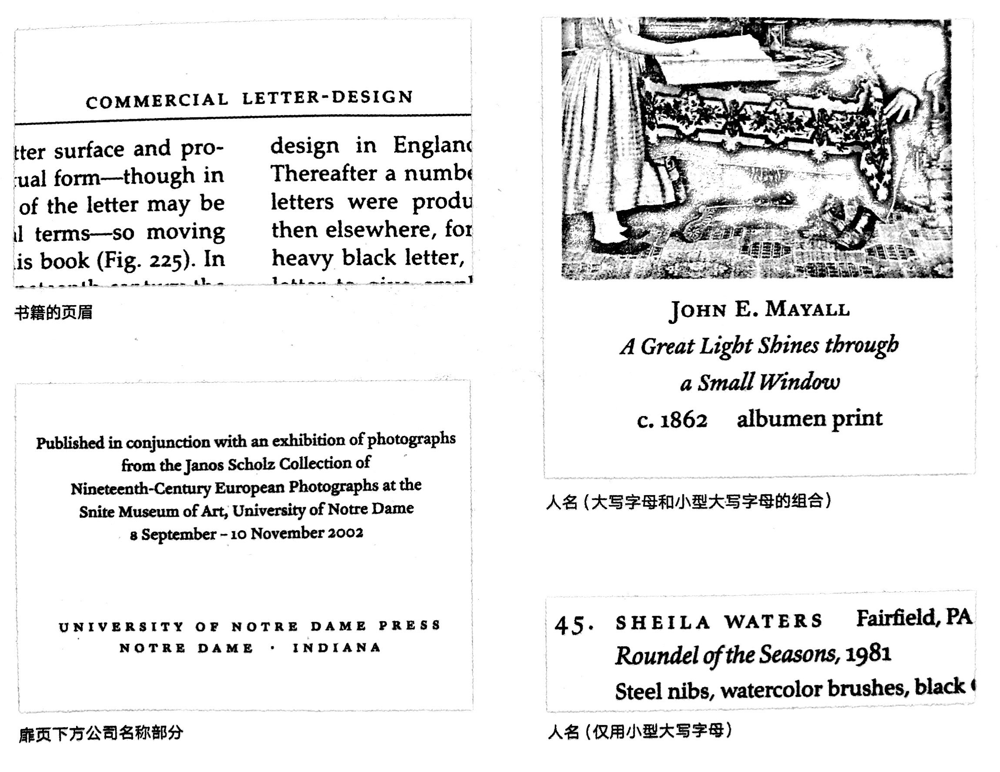

除了单纯用小型大写字母排版，还可以和大写字母搭配使用，只要方法得当就可以有更多的排版可能性。
每次看到出色使用small caps的国外优秀案例，比如商品目录里的短文、标志、商品包装、名片上的人名、公司名等，我就会有一种感觉：这一定是一位精通文字排版的设计师！另外，small caps用在建筑物标识上的效果也很好。
small caps的字距要拉大一些，可以提升字母的美感，令人倍感优雅。

## 数字

拉丁字母里使用的数字，有*阿拉伯数字*和*罗马数字*，阿拉伯数字又包括老式数字和等高数字两类。

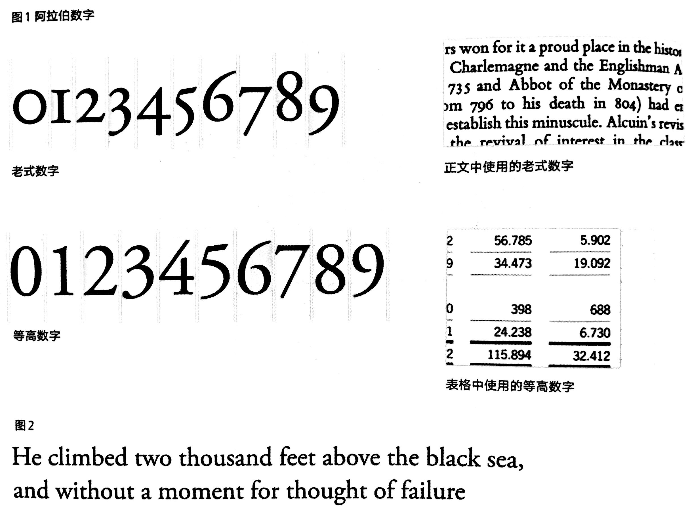

### 阿拉伯数字
  
  老式数字能更好的融入小写字母较多的文章，因此常用于书籍内文的排版。其他并非长篇文章的地方，如美术展画册的解释说明、寒暄的文章等也经常使用。一些无衬线体里也配有老式数字。
  而在财务报表、统计表里，由于数字具有非常重要的意义，正文和表格用的都是等高数字。
  在文章中使用数字时，根据内容，有时候并不使用数字而是用单词拼写。*如果是文学性内容，最好是用单词拼写出数字（图二）*。但如果数字的位数过多也会过于繁杂，所以需要根据具体情况判断。一般来说，三位数以上的数字，如面积、容量等，还有公历都是用数字（在报纸等版式设计中，也有两位数以上写成数字的）。
  数字本身是一个单词，*所以其后如果跟有单位，多数情况下是要加空格的*。单位的省略记法也是一样，但原则上%、℃、$等不加空格。
  
### 罗马数字

  这是一种用字母来表示数字的方法。在阿拉伯数字之前，西方一直用的是罗马数字。到现在，由于很难快速认读出数值，而且计算也不方便，已经不常用了。*但在想表现传统、高品质时，还会使用罗马数字。*
  
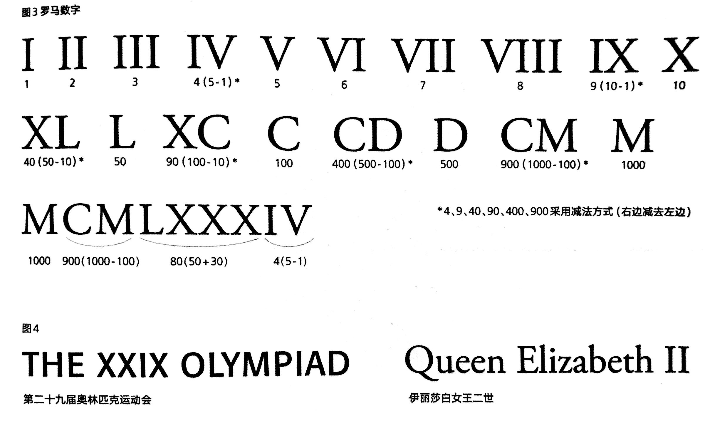
  
  现在，罗马数字常用于时钟的表盘、国际会议、奥林匹克活动等官方的正式写法，一世二世等写法里。在广告界，罗马数字也用于需要体现传统氛围以及高品质的商品里。
  
 
## 用连字符断词
 
 用连字符把单词分开的做法叫「连字（Hyphenation）」，在需要把行尾的单词断开时使用。在两端对齐时，为了让文本的质地更均匀，经常把行尾的单词进行连字处理，使行尾对齐。而左对齐中，过度参差不齐不仅影响美观，而且视线从行尾转移到行首时，视线变行也会造成阅读困难，因此通常也要进行适当的连字处理。
 
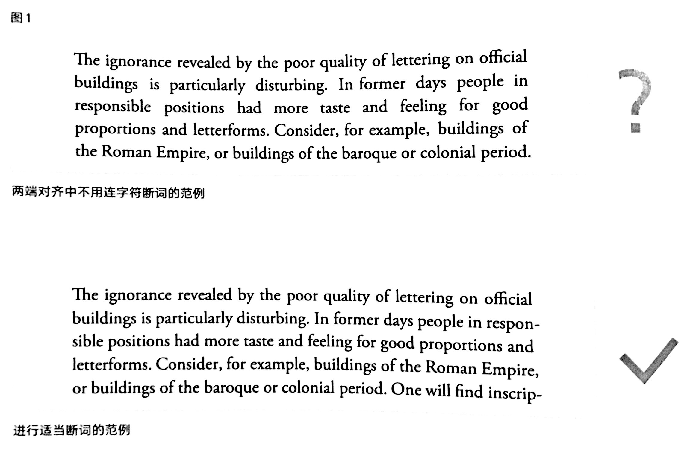

**不过，连续几行一直出现连字符也不美观，因此尽量不要连续出现三行以上。另外避免把专有名词、人名等用连字符断开。将一页的最后一行进行连字处理导致跨页的做法也应该避免。**

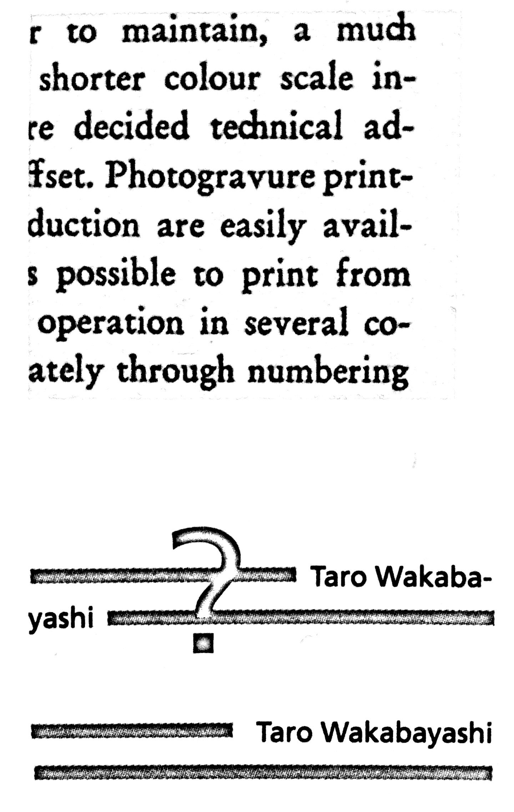

在排版矫正阶段进行修订时，原本行末进行了连字处理的单词有时会移到行内，而有的排版软件会把连字符照样保留下来，这一点需要特别注意。
连字处理的位置根据不同单词而不同，并不是随便在什么地方都可以断开。**基本上是按音节（能整体念出来的一个发音单位）切分**，一定要查字典确认。
 
## 段首缩进

在一行的开头里加入空格，明确表示这是一个新段落的做法叫段首缩进。

**第一段的第一行不要缩进。无论是否有标题，最初的第一行就是文章的开始，这是显而易见的，没有必要缩进。**

**图一**

经常有人问究竟要缩进多少才好，是否有规定。的确，有些书本会提出一定的参考量和数值，但是具体的数值是不一样的。比如有本书说，一般情况下应该将所有字号的em作为缩进长度。比如9pt的字就缩进9pt，12pt就缩进12pt。看起来似乎很合情合理，但正如上图所示，不同行距下的缩进会给人不同的感觉，因此还是不能拘泥于某个固定的数值或者标准。

虽然不能用数字或者某种标准表达出来，但我认为，最合适的段首缩进空间应该是**「一个能让读者清楚明白段落已改变的最小长度值」**。应该避免段首缩进过多而显得扎眼的做法。而且，这还要根据排版内容而改变缩进空间。针对是现在还是传统的内容，可能还需要做不同的判断。关键是要针对整体情况和内容去考虑，通过不断尝试再加以判断。适合实际状况的段首缩进长度，请用自己的眼睛去判断。

## 首字母

**图二**

在《圣经》等手抄本里盛行一时的如花纹般漂亮的首字母，在后来的活字印刷初创期也被广泛使用。在文章的开头空出宽大的空间，把最开始的字母放大，加以装饰性的图案，是为了让读者知道这是文章的开端。
首字母的基本使用方法是，**将其上端与正文的第一行对齐，其下端与正文的基线对齐**。一般来说，首字母最好占正文三行以上。
习惯上，在使用首字母后，正文的第一个单词要用大写字母。如果遇到冠词a这样首字母本身就是一个单词的文章，第二个单词也用大写。不用大写字母而改用small caps也可以。  

## 标点符号

在西文排版中，为了让文章易读易懂，会用各种各样的标点符号。

### 各种点号

**一般来说，文章里的停顿（中断）按照逗号、分号、冒号、句号的顺序依次变长。**
逗号、句号与前面的字母无需空格，但要在后面加空格。偶尔可以看见在句号后面加一大块空格的做法，那是很早之前的习惯。分号、冒号后面也一定要加空格。在文法里，分号、冒号前面也要加空格。

## 问号、感叹号

 

